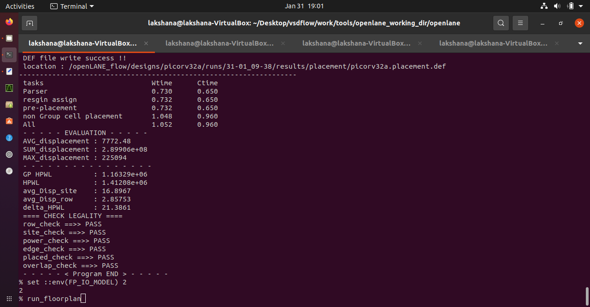
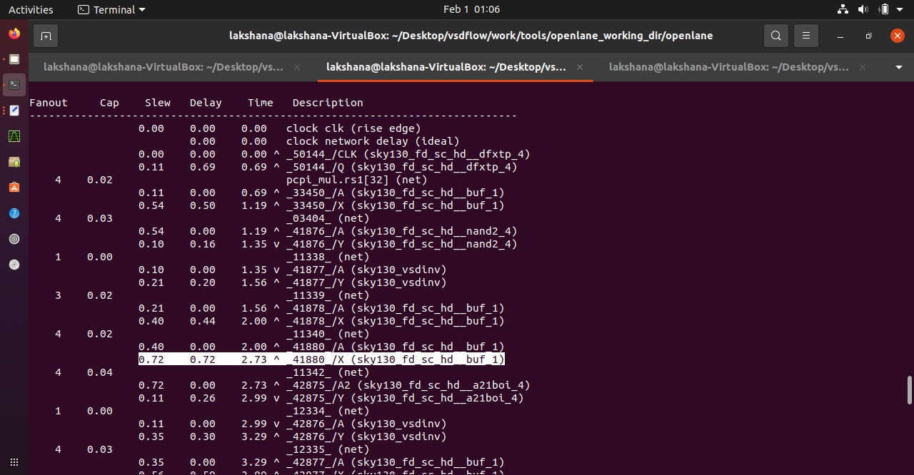
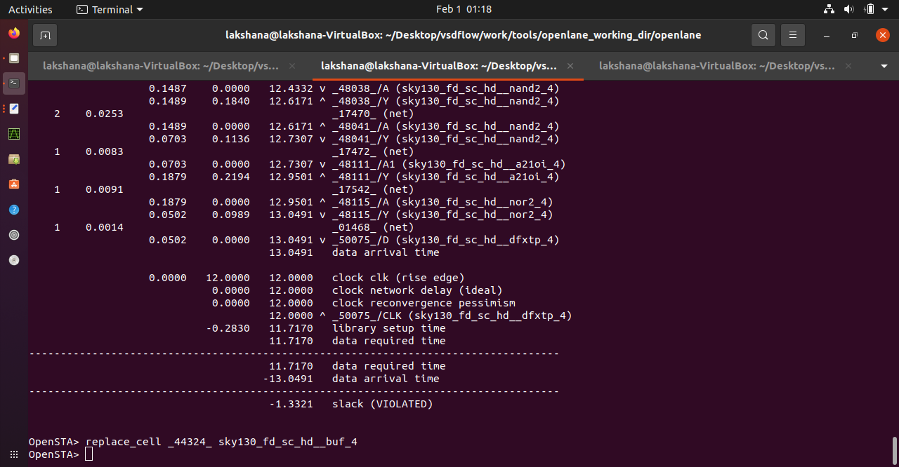
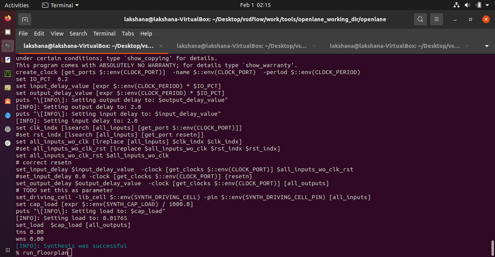
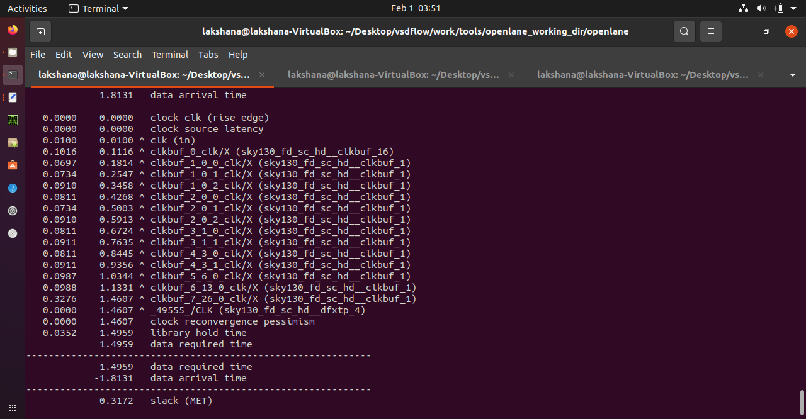
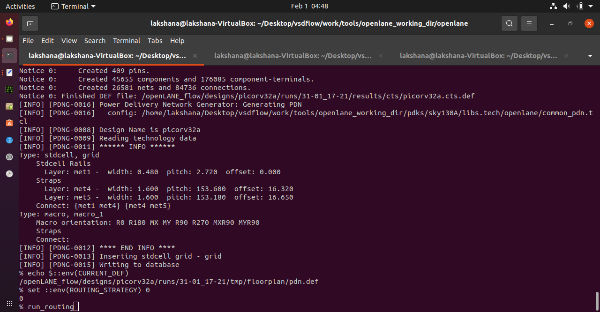

# Advanced-Physical-Design-using-OpenLANE-Sky130


This repository contains all the information present in the Advanced Physical Design using OpenLANE/Sky 130 workshop conducted by VSD.

## Sky130 Day 1 - Inception of open-source EDA, OpenLANE and Sky130 PDK


### SKY130_D1_SK1 - How to talk to computers

This session talks about what is the difference between a chip and a core. Any embedded board will have a processor chip. The processor is connected with multiple interfaces like UART, I2C, QSPI1-Flash, EEPROM, ADC, external SDRAM pins etc. When it comes to chip design, we concentrate on the processor alone. The processor will look something like this. 


This is called a package and here this one is called QFN-48 because it is a quad flat package with 48 pins. The pin locations are usually decided by the design of the embedded board. The chip will be at the center of the package connected to the package pins using wire bonds. 

The manufactured chip is called a die. The chip will have pads through which the package sends signals into the chip and also receive signals from the chip to send to the other components in the embedded board. Inside the chip will be the main core. This is the part where the main digital logic exists. 


A typical core consists of an SoC, SRAM, ADC, DAC, PLL and SPI. Here these are called the foundry IPs(IP - Intellectual property) and these are called Macros. 


This session talks in detail about the RISC-V ISA. ISA is Instruction Set Architecture which is a set of instructions supported by the processor i.e, the language in which we are going to talk to the computer. Here we are mainly talking about the RISC-V ISA which is an open source ISA.

So how does a program run on your processor? The code you write will first get compiled to get an assembly language program which is present in the RISC-V ISA format. This is then converted into a machine code which will then be run on the processor implemented using the RISC-V ISA. The implementation is done using the HDL(Hardware description language). Then the RTL to GDS flow is done to generate the layout of the actual chip. So this is how a program can run on your chip. 


This session talks about how software applications are able to run on the hardware machine. There are 3 major system softwares which make apps run on your hardware. The first is the operating system which handles IO operations, allocates memory and performs low level system functions. The program you write can be in any language like Python or C++. These are converted into instructions(in a .exe file) by the respective compilers, respective to the language you write your program in. The syntax of these instructions are determined by the ISA using which the hardware was implemented. Example, if the hardware was implemented using RISC-V ISA then the instructions are in RISC-V format. Next there is another system software called assembler which takes these instructions and converts them into machine language (binary format) which can then be run on the hardware. How? It is binary...1s and 0s... wire on and wire off... and that’s how it works. 


Here an example of a timer app is shown. The code is converted into instructions(circled) using the compiler which is then converted to machine code using an assembler. The assembler output is shown on the left. This can then be run on the chip layout. 


This is the entire assembler output of the program shown.


The instructions generated act as an abstract interface between the programming language and the hardware. They are called the Instruction Set Architecture(ISA). 


While studying we can’t create a chip and then test it using programs. It is expensive to do it that way. So we can instead use HDL to write an RTL snippet of the hardware which is then synthesized to generate a netlist. Using this we can run our programs. This netlist is then used in the physical design flow of creating the actual chip. 


### SKY130_D1_SK2 - SoC design and OpenLANE

This part of the workshop was taken by Mohammed Shalan. To design an ASIC in an automated way, we need 3 elements - RTL IP’s, EDA tools and PDK. There is actually a design flow.

RTL design is the design of the circuit we need to implement. Electronic design automation tools are the tools needed to design and analyze the design. PDKs are process design kits which are the main files shared between the foundry and the designer. They contain the device models, digital standard cell libraries, design rules etc. 

Open Source RTL designs can be found in librecores.org, opencores.org and github. We also have open source EDA tools like OpenLANE and Qflow. 

Usually, if you want to design and tape out a chip then you have to first approach a foundry. They will be giving you the PDK data and tell you the list of EDA tools you have to use. Because different tools in the design flow have different input formats for the PDK data. So you have to make sure they are compatible. The PDK data comes under the non-disclosure agreement so they are not available for free. Say I want to fabricate a design I have completed. I don’t want to spend on costlier EDA tools. I can instead use open source ones to generate the same result. But the problem is, I can’t tape out my design because I don’t have an open source PDK which supports my open source EDA tools. 

This problem was solved by Google and Skywater(a Pure play foundry) on June 30 when they released an open source PDK for the 130nm process. The PDK has all the needed data for implementation of ASIC design using open source and/or closed source EDA tools. 


Now you may be wondering...isn’t the 130nm process too old?? Surprisingly not! It still has a market share of 6% as per a 2019 report. Also the fabrication cost is comparatively cheaper. Also it is fast! How? A team from OSU observed a post layout clock frequency of 327 MHz in a single cycle RV32i CPU core. So when we pipeline the core, we can easily achieve more than 1 GHz clock frequency. 

Ok now let’s see in detail about what is the design flow I was talking about. The design flow is a software which has multiple design tools to take the design from one step to another in the process of using the RTL(register transfer level) to generate a final file(GDSII) which is used for fabrication. The process design flow consists of the following steps: 


In Synthesis, the RTL is converted to a gate level netlist circuit using the standard cell library. The standard cell layout is enclosed in a fixed height rectangle. The cell width is variable. Each cell has different models utilized by different EDA tools. 


In floor planning, we plan the silicon area according to the different system building blocks. In macro floor planning we define the dimensions, pin locations, rows and routing tracks.


In power planning, we generate a robust power distribution network which connects all the circuits. This is done by using horizontal and vertical power straps and power rings. This uses the upper metal layers so they’ll have lower resistance. 


In placement, the macros gate-level netlist cells are placed in the rows which were defined in the floor planning stage. The cells should be placed near to each other to reduce the interconnect delay. Placement happens in 2 stages - global and detailed placement. First, global placement. Here the optimized position for all cells is decided which is not legalized i.e, some of the cells may be overlapping. This is then legalized in the detailed placement. 


The next is clock tree synthesis. Before routing all the wires between the cells, we need to create the clock distribution network which distributes the clock to all sequential elements in the circuit. We should achieve this with a minimum clock skew (Clock skew - the latency of clock at different components at different positions in the chip). For this, we employ a network called a clock tree which can be an H tree or X tree. 


Next is signal routing. For this we have to find the appropriate pattern of horizontal and vertical wires which are done using interconnects using the upper metal layers designed according to the pdk constraints. The pdk which we are going to use in this workshop is Sky130 pdk. This one has defined 6 metal layers. The lowest layer is called the local interconnect layer and the above 5 layers are aluminum layers. 


The router which we use are grid routers which construct the routing grids of metal tracks. The routing is done using divide and conquer methodology. The global routing generates routing guides and the detailed routing uses these to implement the actual wiring. 

The final stage would be the sign-off stage. Here all the verifications are done. After which we can get the final layout. Physical verifications are done using DRC(design rule checking - checks if the layout is generated according to all design rules given by foundry) and LVS(layout vs schematic - checks if layout matches the netlist generated before - also given by foundry) configured in the pdk. Then we do timing verification which verifies if the chip operates at the appropriate frequency using STA(static timing analysis). 

In this session, let's talk about the open source EDA tool we’ll be using which is [OpenLANE](http://openlane.io/). 


There are a family of striVe SoCs which is done using this open source EDA tool, open PDK and even open RTL. Cool right? The striVe family of SoCs features are described below:


The main aim of OpenLANE was to produce a clean GDSII file with no DRC and LVS violations. But what about timing violations?? Unfortunately that's still a work in progress so we have to manually check and solve them ourselves. 

This open source EDA tool was mainly developed to support the skywater 130nm pdk. However it also supports XFAB180 and GF130G pdks. 

It can be used to tape out macros and chips. It has 2 modes - interactive and autonomous. Each has separate commands. It also has a feature called design space exploration which finds the best set of configurations needed in the design flow. 

You can find design examples created in OpenLANE in this [link](https://github.com/efabless/openlane/tree/master/designs). 

Here we are going to look at the detailed design flow of OpenLANE. Like I said before, in the RTL to GDS2 flow, the RTL file is converted to many intermediate files using many eda tools through the design flow we saw before and finally a GDS file is generated. Here we are using openlane for the asic design flow. So it only implies that openlane integrates all the design tools that are needed to convert our RTL file to GDS2 file. That is true. It has the following tools - OpenROAD, MAgic, KLayout, Fault, Yosys, Qflow and ABC. 


First is the RTL synthesis where like we said before, the RTL code is synthesized to get a gate level netlist circuit using the SCL(standard cell libraries). The tools OpenLane uses for this operation are yosys and abc. Yosys performs RTL Synthesis and abc performs Technology Mapping. 

There are separate strategies to target optimization in area and timing. Designs can choose these strategies using the synthesis exploration tool which maps the delay and area based on the strategy used. 


The design exploration utility generates a report which compares many designs’ design configurations from which you can choose the best set of configurations needed for the design. It is also used for regression testing  i.e., it compares designs with the best known designs  and generates a report using which you can later modify a design. 


The DFT testing step is optional in openlane. It uses the open source project Fault to perform fault coverage, fault simulation, automatic test pattern generation and scan insertion. This adds extra logic which along with the original logic tests for performance.


The physical implementation steps in the automated PnR flow is done using OpenROAD. It does the following operations: floor planning and power planning, adding end decoupling capacitors and tap cells, global and detailed routing, post placement optimization, CTS and global and detailed routing. 

Detailed routing is performed by Triton route which is also an opensource tool but it has not yet been integrated with openlane. The global routing is performed by Fast route. 

Since the netlist generated after synthesis is different from the one after optimization, we need to do LEC(logical functional equivalence checking) which is done using yosys. 

There is also a step called fake antenna diodes insertion where antenna rules violations are checked. First let's see what it means. Whenever a metal wire is fabricated long enough, it can start to act as an antenna and attract charges which will in turn damage the gates connected to this wire during fabrication. It is the job of the router to check the length of wires of the transistor gates. If this is not done, then you can either do bridging(which attaches a higher layer intermediary) or you can insert antenna diodes to leak all the accumulated charges because of the antenna. 


Openlane has a preventive approach to this problem. After placement, a fake antenna diode is added to every cell input. This cell is not a real diode but it matches the footprint of a real diode. After routing, the magic antenna checker is done. If there is a violation, the fake diode cell is replaced by a real one.


 
You have the freedom to choose the openlane approach or the openroad approach to solve the antenna rule violations. 

Sign off as we know involves STA, RC extraction, DRC and LVS checks. For STA, we have to first do RC extraction which converts DEF to SPEF. For STA openlane uses OpenSTA (an Openroad tool) which reports any timing violations. 

Physical verification uses magic for DRC and spice extraction using layout. Magic and Netgen are used for LVS by comparing extracted spice and verilog netlist. 

### SKY130_D1_SK3 - Get familiar to open-source EDA tools

In this session, we’ll get to know about the OpenLANE environment. For explaining this, I have already installed OpenLANE using the information given in this [link](https://github.com/nickson-jose/openlane_build_script).

The input to the openlane is design files(.v, .sdc) and skywater pdks. The output is a GDS2 file or a LEF file. 

**Lab:**


With this, you can find that the openlane directory starts from here(**openlane_working_dir**). Inside this, we’ll have **openlane** and **pdks** directories. Inside the **pdks** directory we have the skywater 130nm pdk data. The **skywater-pdk** directory consists of the actual pdk data like tech and .lef files. We’ll see what they are soon. Till then stay with me. So what do the other files contain? The foundry files were made to work with commercial eda tools. So to make them work with open source eda tools, the **open_pdks** contains certain scripts that make the silicon foundry files to be compatible with the open source eda tools. Ok now let’s check the **sky130A** folder. **Sky130A** is a pdk variant which is made to work with the open source eda tools. 


So inside this we have **libs.ref** and **libs.tech**. To understand them let’s see what’s inside. The libs.ref contains library files related to the technology and libs.tech contains files related to the tools. Here we’ll be using the **sky130_fd_sc_hd** library. As you know right now, sky130 is the process name, fd is library source abbreviation for skywater foundry, sc is library type abbreviation for digital standard cells and hd stands for high density. Likewise to know the other abbreviations check out this [link](https://skywater-pdk.readthedocs.io/en/latest/contents/libraries.html). 

Ok so what do they actually contain? Let’s check. This one has the techlef files which contain the layer information, magic files, cell .lef files and lib files which contain the PVT(Process Voltage Temperature) lib files which define the process columns. tt-typical, ss-slow, ff-fast. 


To start openlane you have to be inside the openlane_working_dir/openlane directory and to run openlane in docker you have to use this command:

```
docker run -it -v $(pwd):/openLANE_flow -v $PDK_ROOT:$PDK_ROOT -e PDK_ROOT=$PDK_ROOT -u $(id -u $USER):$(id -g $USER) openlane:rc6
```

Next to start running the openlane flow, use the `./flow.tcl -interactive `command. The <code>-interactive </code></strong>argument is optional. This will run an step by step interactive openlane flow.

If you want to run an autonomous flow, don’t add this option. Instead run this command: `./flow.tcl -design design_name`

Next we have to add the package using this command: `package require openlane 0.9`.


The openlane has a lot of designs already. You can check them here. We’ll be using **picorv32a**. Inside this you can see that we have src files where we have RTL and sdc files. The **config.tcl** will pass a predefined configuration for the openlane. Same is done by the **sky130A_sky130_fd_sc_hd_config.tcl** file too. But the precedence(low to high) is like this:

1. Default config values set by openlane (This is present in /openlane/configuration)
2. config.tcl 
3. sky130A_sky130_fd_sc_hd_config.tcl

Next we have to setup the design and for that use the command: `prep -design &lt;design> -tag &lt;tag> -config &lt;config> -init_design_config -overwrite`

You can also add tags using **-tag** option, and **-overwrite** option to overwrite your design. However **-design** is required.


This command merges the .lef files(.lef, .tlef) so it does not need to fetch layer and cell information separately. 


Now let’s check if anything new was created. As you can see a **runs** folder has been created which has the following folders. **tmp** folder will store the currently modified files like the merged .lef file. The **results** and **reports** folder will be currently empty because we haven’t started the design flow. The logs folder contains the logs. Here again there is another **config.tcl** file which tells what all default configurations the run has taken. 


Next let’s run the` run_synthesis `command which will run both yosys and abc. 


The design flow steps are ingrained into each command in the openlane flow. So if you want to run say placement, you won’t be able to do that without running synthesis and floorplan. Saying that, if you have run these commands at least once, you will be able to rerun them again to make any changes if you want to.

After the synthesis is done, you will be able to see the chip area, number of cells, etc. Now we can check the **runs** folder for the changes. Check the **results/synthesis** folder. Here we have the synthesized netlist. To check the time reports go to the **reports/synthesis** directory. This is the synthesis statistics report. 


Finally we also calculated the flop ratio and buffer ratio. 
```
Flop ratio = Total no. of flops / total no. of cells 

Buffer ratio = Total no of buffers / total no of cells
```

## Sky130 Day 2 - Good floorplan vs bad floorplan and introduction to library cells


### SKY130_D2_SK1 - Chip Floor planning considerations

In this session, we’ll learn to define the width and height of the core and die. A netlist describes the connectivity of an electronic design. Each gate will have a physical dimension. To find the dimensions of the chip we have to find the dimensions of the standard cells. 

```
Area occupied by the netlist = Combined area of all the standard cells. 
```

A silicon wafer will have many dies. A die is a small semiconductor material specimen which consists of the core. A core is the region where the fundamental logic of the design is placed. The die is repeated in the whole area of silicon wafer to increase the throughput. 

If the netlist area occupies the entire area of the core then we have 100% utilization. So the utilization factor is 1.

```
Utilization factor = area occupies by netlist / total area of the core
```

In an ideal scenario, we go for 50-60% utilization so that we have space to add some other logic. There is also the concept of aspect ratio which is height/width of core. When aspect ratio is 1, the chip is a square. 

There are some IPs which can be implemented once and instantiated many times in a netlist. The placement of these IPs in a chip is called floorplanning. They have user defined locations so they are placed before the placement and routing step. And hence they are called as preplaced cells. Some examples of preplaced cells are mux, memory, comparator etc. The automated placement and routing places the remaining logical cells in the design on the chip after the preplaced cells are placed. 

The location of preplaced cells in a chip is defined by the design scenario. A switching operation in a logic circuit demands switching current. The voltage provided by Vdd might not be enough because of the resistances and inductances present in the wire and so it can go below the noise margin range(NMh). So the output might not be detected as logic 1. So to provide the necessary switching current we are using decoupling capacitors in parallel with the circuit. 


When we are connecting multiple blocks, there is a possibility of voltage drop happening in the wire connecting the blocks. Here we can’t add any decoupling capacitors so in this case we can only use the power rails with multiple Vdd and ground tap points to maintain the voltage. 


The connectivity of gates is written in verilog/vhdl and is called as the netlist. Generally, all the input ports are put on the left side of the chip and all the output ports are configured on the right side of the chip. The ordering of I/P and O/P ports depends on the placement of preplaced cells. Usually, the front end team decides the netlist connectivity and the backend team decides the pin placements. 

The clock ports are bigger in size compared to the data ports because they need a least resistance path as they are the ones driving the entire chip. Next we do logical cell placement blockage so we don’t place any cells in the area where we have defined the ports. Now our floorplan is ready.


In floorplan we set the die area, core area, aspect ratio and utilization factor. We place the IO cells, macro cells and create the power distribution network. The standard cell placement happens in the placement stage. 

**Lab:**

To run floorplan use the command `run_floorplan`. 


But before this we need to activate a set of switches for the floorplan stage. So to do that let’s go to the **openlane/configuration** folder and open **readme** file. Here you can see all the configuration variables and their default values present in openlane for each stage. 


These switches are set in these respective files according to the stage of the PnR flow. Now note that these are the default values which are set by openlane. Also note that these have the lowest priority. 


PnR flow is an iterative flow so you can set any of these variables based on where you are in the flow. 

Now to check the precedence of variable instantiation, let’s set the core utilization as 65, vertical and horizontal metal layer values to be 2 and 3 in the **config.tcl** file inside the **picorv32a** folder. In openlane flow, the **vmetal** and **hmetal** layer is one more than what you specify. 


With these settings let’s run the floorplan using the command

`run_floorplan`.


Now let’s check the changes. Go to the **runs/latest_run/logs/ioplacer.log**.


 Here you can see that the vmetal and hmetal layers are 3 and 4 like we predicted. The **config.tcl** has overwritten the system defaults. Now let's check the core utilization by checking the config.tcl file in the **runs** folder. 


Here as you can see, we have all the configuration variable values. Under floorplan we can find the variables we had set. But why hasn’t the core utilization value changed? 


It is because the **sky130A_sky130_fd_sc_hd_config.tcl** file has a different value for core utilization and it has overridden the variables in the **config.tcl** file which we had given. 

To view the floorplan go to **results/floorplan**. 


Here there is a **.def** file which means design exchange format. It contains the orientation of all cells in the chip. Here the die area is specified in this format (lower_left_x lower_left_y) (upper_right_x upper_right_y). Using this you can calculate the area of the die. The unit is defined here. Here it is given as 1 micron = 1000 units. So to get the actual value in microns, divide the numbers by 1000. 

To view the actual layout we’ll use the magic tool. To open this file in magic, we need the magic’s **sky130a.tech** file and the **merged.lef** file from the **tmp** folder. Now use this command:

`magic -T /home/lakshana/Desktop/vsdflow/work/tools/openlane_working_dir/pdks/sky130A/libs.tech/magic/sky130A.tech lef read ../../tmp/merged.lef def read picorv32a.floorplan.def &`


The default value set for the IO pin mode was 1 which was setting them in random equidistant mode. 


Ok now lets select this cell and check what layer it is in. You can do that by using the `what` command in the tckon window. Here it shows it is in horizontal metal layer 3. 


Now let's check the horizontal metal. This one is vertical metal layer 2 like we had set.


There are decap cells on the left and the cells in the middle are called the tap cells which are meant to avoid latch up conditions in cmos devices. These are diagonally equidistant. 

The floorplan as we know doesn’t take into consideration the placement of standard cells. So where are they?? They are here on the lower left corner. 


### SKY130_D2_SK2 - Library Binding and Placement

We have to bind the netlist with the physical cells. A library is a place where we can find the width, height, timing information and required condition of all physical cells. It also has different size variants of the physical cells (large size -> less resistance). 

The cells will not be placed in the area where we have placed the preplaced cells. The placement is such that the logical connectivity is maintained and the cells are placed close to their input and output ports. 

Here we’ll estimate wire length and capacitance to calculate signal integrity. 

When there is a huge distance between the cells, to maintain the signal integrity, we have to add repeaters or buffers in between the cells. The only disadvantage is the area occupied will be more. We have to make sure that the timing conditions of the circuit are met so make sure to place the circuit close to the respective input and output ports. 

Slew depends on the capacitor. So when there is a long wire, capacitance is more and so slew is more. Next we have to do a setup timing analysis with ideal clocks using which we can check if the placement condition is meeting the specifications. 

From synthesis to sign off, gates or cells are common. The collection of gates is called a library. We need to model these gates in such a way that the eda tools understand the gates and their timing characteristics. 

Next stage after the floor plan is placement. Initially the default desired placement density of cells was 0.4 which means they are a bit widely spread. 


Placement happens in global placement(coarse placement - not legalized - reducing half parameter wire length). Standard cells have to be placed inside rows and they should be abetted. Legalization is needed from the timing point of view. 

**Lab:**

Run placement with command `run_placement`.


When global placement happens, the half parameter wire length is shown here and the overflow decreases and approaches a converging value. 


There is no overlap. 


To see the design after placement go to **results/placement** and open the **.def** file with magic. Now the standard cells are correctly placed in the rows. 


In openlane the generation of PDN doesn’t happen in floorplan. It happens after CTS.  

### SKY130_D2_SK3 - Cell design and characterization flows

Standard cells which are placed during the placement stage are placed in a section called libraries. The library has standard cells with different threshold voltages(determines speed), different functionality and also different sizes. 


A cell design flow has 3 parts- inputs, design steps and outputs. The inputs to design a cell are pdks having DRC & LVS rules(lambda based design rules given by tech file), spice models(threshold voltage equation - spice model parameters), library and user defined specs(cell height, drive strength and supply voltage, metal layers requirements, pin location, drawn gate length). All of these are given by the foundry. 

Design steps - 3 steps - circuit design(implement function, model pmos nmos transistor to meet library requirement(W/L, Id)), layout design(get pmos and nmos network graph out of the circuit design using euler’s path, draw a stick diagram, convert to layout according to DRC rules and user specs) and characterization(extract parasitics from layout and characterize them in terms of timing).

Output - O/P of circuit design - CDL(circuit description lang), O/P of layout - GDS2, LEF(defined width and height of cell), extracted spice netlist(.cir)(resistances and capacitance of the layout), O/P of characterization - timing, noise, power .libs and functionality

.cir -> sub circuit of inverter -> nmos and pmos spice models(characterization of nmos and pmos) 

1. Read the model files
2. Read .cir
3. Recognize behaviour of buffer
4. Read sub circuit of inverter
5. Attach power sources
6. Apply stimulus 
7. Provide necessary O/P capacitance and find characteristic wave 
8. Necessary simulation command
9. Feed all inputs in the form of characterization file to GUNA software -> generates timing, noise and power .libs and function

### SKY130_D2_SK4 - General timing characterization parameters

Slew_low_rise_thr - typical value 20%
Slew_high_rise_thr - typical value 80%
Slew = Slew_high_rise_thr - Slew_low_rise_thr
Slew_low_fall_thr - typical value 20%
Slew_high_fall_thr - typical value 80%
In_rise_thr - typical value50%
In_fall_thr - typical value 50%
Out_rise_thr - typical value 50%
Out_fall_thr - typical value 50%
```
Delay = (In_rise_thr - 50%) - (Out_rise_thr - 50%)
Propagation delay = time(out_fall_thr) - time(in_rise_thr) (typical value of 50%)
Transition time = time(slew_high_rise_thr) - time(slew_low_rise_thr)
```
Negative delay -> poor choice of threshold values or huge wire delays.

## Sky130 Day 3 - Design library cell using Magic Layout and ngspice characterization


### SKY130_D3_SK1 - Labs for CMOS inverter ngspice simulations

If I want to change the IO pin strategy we can set it now. There are 4 strategies supported by the **ioplacer** (open source eda tool to place IO around core). You can check the default value in the **floorplan.tcl** file. It is not given there but 2 is one of the mode strategies supported by ioplacer. 

**Lab:**

So let’s set it: `set ::env(FP_IO_MODEL) 2` and `run_floorplan`.



Now let’s check the **.def** file again. Now as you can see pins are not equidistant anymore. Like this, you can change the variables and run the flow again. 


SPICE deck is a netlist which has component connectivity information, inputs and tap points. In the SPICE deck, we need to define connectivity of the substrate pin(tunes Vth of nmos and pmos) also. 

1. The value of the O/P load capacitor is decided by the I/P capacitor of the next circuit. 
2. Next is component values - W/L values of pmos and nmos. Ideally pmos should be 2 times larger than nmos. 
3. I/P gate voltage is a multiple of channel length. 
4. Identify nodes in the circuit. 
5. Name nodes. 
6. Write spice deck. 
7. MOS (d g sub s). Typically for cmos inv gate I/P volt lies between gate and gnd. 
8. Write simulation commands. 
9. Describe model file. 
10. Do Spice simulation. 

Rise and fall delay varies with varying Vm.

Static simulation - DC characteristics, Dynamic simulation - transient analysis.

`I/P Rise delay = 50% rise I/P wave - 50% fall O/P wave`


In this lab session, we are going to do spice simulations on the cmos inverter. To do this, we have to clone to the git [repo ](https://github.com/nickson-jose/vsdstdcelldesign)and download the inverter mag file. To run this we need the **sky130a.tech** file for magic from the **pdk**. Copy and paste it in the folder.

Now open the file with magic using the command  `magic -T sky130A.tech sky130_inv.mag &`

### SKY130_D3_SK2 - Inception of Layout – CMOS fabrication process

**16-Mask CMOS Process steps:**

1. Selecting a substrate
2. Create active regions for nmos and pmos transistors
3. Formation of n-well and p-well
4. Formation of gate terminal
5. Lightly Doped Drain (LDD) formation
6. Source and drain formation
7. Local interconnect formation
8. Higher level metal formation

**Lab:**

Inverter is a combination of pmos and nmos. 

Explained layers in Magic tool: 

1st layer-local interconnect - locali -blue
2 - metal1 - purple
3 - metal2 - pink cross
4- nwell - solid black slanting dash
When poly crosses ndiff(green) -> nmos.


When poly crosses pdiff -> pmos.


Y connected to drain of pmos and nmos.


Source of pmos connected to Vdd and source of nmos connected to gnd.

LEF - library exchange format -> just has all metal layers - no info about logic.

For PnR placement of macro, we only need info of ports, vdd and gnd lines and pier boundaries.

This way LEF protects the IP. LEF is also called frame view in commercial tools.

Magic tool has interactive DRC. You can find DRC rules [here](https://skywater-pdk.readthedocs.io/en/latest/rules/periphery.html). To check DRC errors, go to **DRC** on top and click find the next error. Middle mouse button to select layer. Extract to spice and do simulations on spice using ngspice. 


To extract to spice use the command `extract all` in the magic tckon window. To create a spice file, use command `ext2spice cthresh 0 rthresh 0` to extract all parasitic capacitances also. Next do `ext2spice`. Here you can find the spice file. 


### SKY130_D3_SK3 - Sky130 Tech File Labs

Understanding the spice file: 

To do transient analysis, connect Vgnd to Vss, Vpwr to Vdd 3.3V, Va.


The scale value should be equal to the grid value in the layout so let’s get it. 


Here it is  0.01u.

Next include pmos and nmos .lib files. Add vdd, vss, va and trans for transient analysis.

We also have to change the model names of pmos and nmos. 


To run use the command `ngspice sky130_inv.spice`.


To reduce spikes, change load capacitance to 2fF.


`plot y vs time a`


Rise transition = 20%(3.3V) = 0.66; 80%(3.3) = 2.64 => 6.57299 - 2.327 = 4.24599 ns


Cell rise delay =  1.03686 - 1.01505 = 0.02181 ns


**Lab: Introduction to Magic**


## Sky130 Day 4 - Pre-layout timing analysis and importance of good clock tree


### SKY130_D4_SK1 - Timing modelling using delay tables

Follow guidelines when making a standard cell set - I/P and O/P ports must lie on the intersection of vertical and horizontal tracks + width of standard cell should be odd multiple of x pitch and height should be odd multiple of vertical pitch. 

**tracks.info** used in the routing stage contains horizontal and vertical track pitch information for every metal layer. 


The ports a and y should be on the intersection of li1 horizontal and vertical tracks. 


To check this I’m changing the grid size to the size given in the **tracks.info** file. 

`grid 0.46um 0.34um 0.23um 0.17um`


Routing of li1 has to happen along this grid. As you can see **a** and **y** are in the intersection of horizontal and vertical tracks. 


Width of standard cells should be within odd multiple of x pitch. Height of standard cells should be within y pitch. This ensures that standard cell layout has been done according to the requirements of openlane. 

Ports are needed when we extract a .lef file. Ports are defined as pins. Likewise define ports for all layers. For pwr and gnd, attach it to met1. 


Once ports are defined, next define the purpose(I/P or O/P) of the post. For that we do port class and port use. 

Next extract .lef file. Set a custom name.  


Open the saved file and use the command `lef_write`.

Open .lef file.


We will be plugging in the .lef file in picorv32a design so copy **.lef** file to **picorv32a/src**.


The 1st stage is synthesis so the abc tool maps cells to the library. Have a library which has cell definition to include in synthesis. We have them here. 


Here this lib file is a typical speed i.e., nmos and pmos run at typical speed, operating at 25c and 1.8V. 


In the slow lib file pmos and nmos are of slow slow type and have an operating temp of 100c and 1.6V i.e., they’ll have a max delay. 


Similarly for the fast fast lib. We need these for STA. So let’s copy them to the **src** folder. 


The lib has the timing definitions like rise time delay, etc defined for each standard cell. 

In the **config.tcl** file we have to add the following lines:

**LIB_SYNTH** is the lib file for abc mapping.

```
set ::env(LIB_SYNTH) "$::env(OPENLANE_ROOT)/designs/picorv32a/src/sky130_fd_sc_hd__typical.lib"
set ::env(LIB_SLOWEST) "$::env(OPENLANE_ROOT)/designs/picorv32a/src/sky130_fd_sc_hd__fast.lib"
set ::env(LIB_FASTEST) "$::env(OPENLANE_ROOT)/designs/picorv32a/src/sky130_fd_sc_hd__slow.lib"
set ::env(LIB_TYPICAL) "$::env(OPENLANE_ROOT)/designs/picorv32a/src/sky130_fd_sc_hd__typical.lib"
```

The last 3 are used for STA.


To include extra lefs in the flow i.e., the custom lef file use command:

`set ::env(EXTRA_LEFS) [glob $::env(OPENLANE_ROOT)/designs/$::env(DESIGN_NAME)/src/*.lef]`

We also have to include these commands during the design flow. So let's start from first.

Do the initial design configuration steps. 

After this, add these lines to ensure that openlane includes the **.lef** file. 

```
set lefs [glob $::env(DESIGN_DIR)/src/*.lef]
add_lefs -src $lefs
```

These include **sky130_vsdinv.lef** in **tmp/merged.lef.**

Now `run_synthesis`. Mapping is taken from LIB_SYNTH.


Now we have a huge slack violation in the synthesis stage itself. We’ll have to fix it.

**Clock tree synthesis(CTS):**

Power aware CTS using and(en-1 , clock) and or(en-0, clock) gates.

How to use this in the clock tree? clock gating - swap buffer with a gate -> gating clock to rest of a circuit under certain conditions. 

**Timing characteristics of buffers:**

Typical requirements of good clock tree are

- At every level each node drives the same load 

- Identical buffer at same level. 

All buffers at each level should be the same. 

Varying I/P transitions -> varying O/P loads -> delay was calculated for different buffer sizes(fixed size and fixed Vth). 

Similarly delay tables were created for every type of cell and those delay tables become the timing models. Each gate will have a delay table. There will also be a delay table for different buffer sizes. Changing size means varying resistance of that device - varying RC constant - varying delay. 

The output delay of a buffer is a function of I/P transition and O/P load. In a circuit, to find the delay of the whole circuit, add the delays of cell delays(excluding wire delays) using the delay table. 

Delay table - slew vs O/P load

The skew at any endpoint should be 0. As the skew propagates through a circuit, it will become large and that might lead to setup and hold time slack. 

**Timing analysis:**

Tns - total negative slack | Wns - worst slack(max slack)

Change SYNTH_STRATEGY - strike a balance between delay and area - default value is 2.

```
echo $::env(SYNTH_STRATEGY)
set ::env(SYNTH_STRATEGY) 1
```
`//set ::env(SYNTH_BUFFERING) 1` - buffering high fanout nets - default value is 1

`set ::env(SYNTH_SIZING) 1 `- upsizing or downsizing a buffer based on delay strategy - default is 0

`set ::env(SYNTH_DRIVING_CELL) `- cell that drives the I/P port - more fan out - more drive strength cell to drive I/P - DEFAULT inv_8

`run_synthesis `

Slack is reduced.

`run_floorplan`

Check if custom lef is added to merged.lef.

`run_placement`


Now check **results/placement/.def** file.

Yes, you can find **sky130_vsdinv**.


Let’s open **placement.def**. 


Abetment is to ensure that power and gnd rails are shared.  

### SKY130_D4_SK2 - Timing analysis with ideal clocks using openSTA

Timing analysis of ideal clocks. clock frequency = 1GHz, clock period =1ns

**Setup analysis of single ideal clock:**

Consider 2 flops - launch and capture flop. The time period of 1 clock pulse (1+0) is given i.e., if 1 is given at the left edge, 0 is given at the right edge.


Combinational delay = O

O should be less than T(time period).

The capture flop consists of 2 mux - each has delay - internal delay of mux1 is called setup time(S). 


`O < (T-S)`

Clock jitter - clock source might not be able to generate clock edge exactly at 0ns. So there is a window within with clock edge can arrive -> jitter -> temporary variation of clock period.

`O < (T - S - SU)`

SU - setup uncertainty - happens in only setup timing analysis because different inputs are going to the clock. In hold time analysis, the same I/P is given to clocks. 

`Combinational delay = Delays of components + wire delays`

**Lab:**

To ensure that slack is reduced, carry out timing analysis in OpenSTA.

In **openlane/pre_sta.conf**,


```
set_cmd_units -time ns -capacitance pF -current mA -voltage V -resistance kOhm -distance um
read_liberty -max ~/Desktop/vsdflow/work/tools/openlane_working_dir/openlane/designs/picorv32a/src/sky130_fd_sc_hd__slow.lib
read_liberty -min ~/Desktop/vsdflow/work/tools/openlane_working_dir/openlane/designs/picorv32a/src/sky130_fd_sc_hd__fast.lib
read_verilog ~/Desktop/vsdflow/work/tools/openlane_working_dir/openlane/designs/picorv32a/runs/31-01_17-21/results/synthesis/picorv32a.synthesis.v  
link_design picorv32a
read_sdc ~/Desktop/vsdflow/work/tools/openlane_working_dir/openlane/designs/picorv32a/src/my_base.sdc 
report_checks -path_delay min_max -fields {slew trans net cap input_pin}
report_tns
report_wns
```


The pre_sta.conf is the main file with which we’ll be doing the STA analysis. 

Use command `sta pre_sta.conf`. This will show the same slack value. 


We haven't done CTS, so skew is 0. So the hold analysis values won't make sense. It comes after CTS. Let's check for setup analysis. Check for all delays which are high. Delay is function of input slew and output load. 

Here delay is also high and fanout is also high. So let's optimize the fanout value. 


`set ::env(SYNTH_MAX_FANOUT) 4`

`run_synthesis` again.


Here for example the drive of this net **_10208_** is just a size 1 buf but it  is driving a heavy load so there will be slack. So change it with buf 4.


Once synthesis is complete, rerun STA and check slack. It has been reduced now. 


Ok we still have a large delay given by this buf1 here. More fanout -> more slew.



Slew gets worse as it gets propagated through the buf.

And this has high capacitance. 


So this buffer is driving out 4 I/P pins. 


So now let's replace this buf by buf 4 (upsizing the buf)using this command:

`replace_cell _41880_ sky130_fd_sc_hd__buf_4`

Let’s check now using the command: 

`report_checks -fields {net cap slew input_pins} -digits 4`

Now the slack has decreased further. Let’s reduce it further by changing this buffer **_44324_**.




The slack has been reduced well to **-0.66**. Since we have modified the buffers otu netlist would have been changed. 

`report_checks -fields {net cap slew input_pins} -digits 4`


`report_checks -from _50144_ -to _50075_ -through _44324_`

Resolve timing, generate timing ECO from STA and feed it to place and route tools.

### SKY130_D4_SK3 - Clock tree synthesis TritonCTS and signal integrity

CTS - ensures that the clock is distributed evenly to all sequential elements. Clock tree synthesis is used to connect clocks with different serial components. But since the physical distance of different components is different the clock reaches them at different times. This is called clock skew. 

`Skew = t2(time taken for clock to reach ff2) - t1(time taken for clock to reach ff1)`

Ideally skew should be close to 0 ps. To solve this we use an H tree which calculates the midpoint from source to all endpoints and builds a tree from the midpoint to the midpoint of other sequential elements. Because of this, the clock reaches all points at the same time so skew will be close to 0. 

Clock tree buffering - If there is a long wire, it has to charge all capacitances and reach the midpoint which will lead to signal integrity issues. So the solution is adding repeaters or buffers. The only difference between the repeaters we used in placement and here is that here, these repeaters will have equal rise and fall time. This makes sure that the clock integrity is maintained.


Clock net shielding: protects clock nets from crosstalks. Crosstalk happens because of huge coupling capacitances between wires. 2 prob - glitch and delta delay.

Glitch - if there are 2 nets having high coupling capacitance then change in one wire can cause a glitch in the adjacent net. For eg: if the logic transition happens from 1 to 0 and if the adj net was showing logic 1(not switching), there is a dip in the logic 1 and glitch happens and this can affect the memory if this line was a reset to the memory. 

Shielding breaks the coupling capacitor i.e., in shielding you are placing shields connected to Vdd or Gnd so they don't switch. 

Ok now what happens if the victim was also switching from 1 to 0 at the same time? The transition of 0 to 1 in the 1st wire might impact the 1 to 0 transition by a delta delay. So the total delay of the cell now will be D+delta_delay(after crosstalk) and so skew is delta_delay.


If there were many buffers then the skew might grow exponentially.

Clock nets are shielded to avoid crosstalks. Put a shield around clock nets. All critical nets should be shielded. 


**Lab:**

Let’s try to reduce the slack further.  Again let's replace this buffer **_47971_** with buf 8.


I have also changed 1 more buffer. 


Now finally slack is **-0.799**.


Next we have to save the changes to a verilog file and add it to the flow.

To do that use command: `write_verilog` and overwrite the verilog file from synthesis.

To check if the new netlist has been replaced, search for the last changed buffer value.


Next don't `run_synthesis` again or we’ll get the same slack value so now run floorplan which will take a new netlist with reduced slack.



Next `run_placement`. 


Next `run_cts`. Let's check cts variables. 


*   Target_skew - fixes overall clock skew
*   Root-buffer - this is where branching starts - needs to be a higher buffer with higher drive strength
*   Clock_tree_synth - enables CTS for triton CTS
*   Cts_tolerance - represents a tradeoff of QoR(quality of result - skew, clock pulse width) and runtime | high - low runtime, worse QoR

In CTS, clock buffers get added so it again modifies the verilog netlist. 

Ok so what happens in run_cts? These commands are defined as tcl procs in openlane. 

To check where openlane takes these procs from, go to **openlane/scripts/tcl_commands/cts.tcl**. 

Procs are similar to functions. 


It invokes a openroad script here - **scripts/openroad/or_cts.tcl**

Before CTS, the current def is the one abstained after placement. After CTS the current def will be in **results/cts/picorv32a.cts.def**.

Next is PDN and routing which uses this **.def** value. The sdc value passed is the **base.sdc** in the **scripts** folder. 

CTS - this is where control is passed to Triton CTS (engine that's is used for CTS) with these parameters:


Right now we are doing CTS for a typical corner. It can't do CTS for multiple corners simultaneously yet. 

### SKY130_D4_SK4 - Timing analysis with real clocks using openSTA

The clock tree will have buffers now. So because of them the buffer delay also adds up. 

`Data arrival time ((O+d1)) &lt; ((T+d2) - S - SU) Data requirement time`


Skew = d2-d1

`Slack = data requirement time - data arrival time ( should be +ve or 0)`

Hold timing analysis using ideal clocks: (both clocks sent simultaneously)

`O > H `| hold time - internal delay of mux 2


When buffer delays are added, 

`O+d1 > H+d2`


Data arrival time (O+d1) > (H+d2+HU) Data requirement time


`Slack = data arrival time - data requirement time = should be +ve or 0`

D1 = real wire rc delays+buf delays

D2 = real wire rc delays+buf delays

`Skew = d1-d2`

**Lab:**

Openroad also has OpenSTA integrated in it.

Use command `openroad` to invoke timing analysis.

First create a db database.


`read_lef /openLANE_flow/designs/picorv32a/runs/31-01_17-21/tmp/merged.lef`

```
read_def /openLANE_flow/designs/picorv32a/runs/31-01_17-21/results/cts/picorv32a.cts.def
write_db pico_cts.db
read_db pico_cts.db
read_verilog /openLANE_flow/designs/picorv32a/runs/31-01_17-21/results/synthesis/picorv32a.synthesis_cts.v
read_liberty -max $::env(LIB_FASTEST)
read_liberty -min $::env(LIB_SLOWEST)
read_sdc /openLANE_flow/designs/picorv32a/src/my_base.sdc
set_propagated-clock [all_clocks]
```

`report_checks -path_delay min_max -format full_clock_expanded -digits 4`

You can't compensate for hold slack violations in the final tape out. 


We have done CTS for typical corner whereas the lib we have used here is slowest and fastest lib. So we have built a clock tree for a typical corner but we are analyzing it for min and max corners. So the analysis is wrong. 

Exit from openroad.

`openroad`


`read_db pico_cts.db`

```
read_verilog /openLANE_flow/designs/picorv32a/runs/31-01_17-21/results/synthesis/picorv32a.synthesis_cts.v
read_liberty $::env(LIB_SYNTH_COMPLETE)
read_sdc /openLANE_flow/designs/picorv32a/src/my_base.sdc
set_propagated-clock [all_clocks]
```

`report_checks -path_delay min_max -format full_clock_expanded -digits 4`

Now both hold and setup slack is good. But usually for a typical corner there won't be any slack violations.  




Triton CTS doesn’t currently support multi corner optimization.This was the post CTS analysis.

LAB:  Replace the netlist - run floorplan, placement and CTS. 


When openlane is building CTS, it tries to meet skew value by inserting clock buffer from left to right. Skew value should be 10% of max clock period.

`run_cts`


`openroad`

```
read_lef /openLANE_flow/designs/picorv32a/runs/31-01_17-21/tmp/merged.lef
read_def /openLANE_flow/designs/picorv32a/runs/31-01_17-21/results/cts/picorv32a.cts.def
write_db pico_cts1.db
read_db pico_cts1.db
read_verilog /openLANE_flow/designs/picorv32a/runs/31-01_17-21/results/synthesis/picorv32a.synthesis_cts.v
read_liberty $::env(LIB_SYNTH_COMPLETE)
read_sdc /openLANE_flow/designs/picorv32a/src/my_base.sdc
set_propagated_clock [all_clocks]
```

`report_checks -path_delay min_max -format full_clock_expanded -digits 4`

Slack has improved but the area has taken a hit.

`report_clock_skew -hold`

`report_clock_skew -setup`

## Sky130 Day 5 - Final steps for RTL2GDS using tritonRoute and openSTA


### SKY130_D5_SK1 - Routing and design rule check (DRC)

**Maze Routing – Lee’s algorithm:**

Routing means connecting 2 points. From an algorithmic point of view - find the best possible route(or shortest route) with less no of twists and turns(without many bends) from source to target.

Routing cannot happen over the preplaced cells. Algorithm creates a routing grid with standard dimensions and already has a source and target points. 

All adjacent(horizontal and vertical) grids are labelled 1. Likewise each adjacent grid is named with the next integer.

It continuously happens till the target pin is reached. Now there is a path from source to target. Actually there are many routes to reach the target. But which one is ideal? Any route with single bends are mostly preferred over routes with multiple bends. 

If there are millions of routes, it takes a lot of time. 

**DRC checking:**

DRC checks to be followed while routing:

3 typical DRC for pair of wires:

1. Min wire width - tech to build wire using photolithography - wavelength of light is same so it can only have a min width wire
2. Min wire pitch(center to center distance)
3. Min wire spacing

DRC violation type: signal short -> solved by using another layer for the 2nd wire(top)

Upper metal layers are wider than lower metal layers - signal integrity

1. Min Via width (connect top and bottom metal layers using via)
2. Min Via spacing - spacing between vias

Next is parasitic extraction - wire r and c extraction - spef format. 

### SKY130_D5_SK2 - Power Distribution Network and routing

**Lab:** PDN


Check current_def using command `echo $::env(CURRENT_DEF)`

`gen_pdn`

Standard cell rails - placed along standard cell rows. The pdn has been generated.


Core gets power from vdd and gnd pads from this power goes to rings and from there it reaches the straps and from these power goes to standard cell rails. 


**Lab:** Routing

Now current def is **pdn.def**.


Let's check switches for routing. 


The main switch is **ROUTING_STRATEGY** specify optimization mode to be used in the triton route which is the routing engine. It has 4 modes. 0 to 3 and 14. Mode 14 is set to use tritoroute14. 

Tritonroute14 is an upgradation to Tritonroute13 -14 - 45min to 1hr to complete run

0 mode - routing not so optimal (has DRC errors), but faster runtime and less memory requirement - 30mins

`run_routing`



The entire routing process is complex - so divided into global route(Engine used is Fast route) and detailed route(Engine used is Triton route).

In the global route, the entire routing region is divided into grid cells and a 3D routing graph is used. In a detailed route, it should ensure it realizes the segments and vias in accordance with the global route solution. 

O/P of global route is a set of routing guides for each of the nets. In a detailed route, the best possible connectivity among the routing guides is decided using an algorithm. 

### SKY130_D5_SK3 - TritonRoute Features

*   Engine used for detailed routing
*   Honors preprocessed route guides(should have unit width, should be in preferred direction) and attempts to route within route guides


*   Assumes route guides for each net satisfy inter guide connectivity
*   Find the best possible way for routing connections - for that it uses a MILP(mixed integer linear programming) based panel routing scheme with intra layer parallel(within layer the routing happens in parallel) and inter layer sequential(b/w layers the routing is sequential) routing framework. 
*   Each route guide has its preferred directions. (alternate orientations of metal layer to reduce the common capacitive area between them)


*   Initial route guides -> splitting -> merging(if direction is not preferred merge) -> bridging(guides parallel to preferred route guide are bridged) -> preprocessed guides
*   Divide no preferred direction route guides to unit width.
*   Interguide connectivity - if the same metal layer with touching edges then they are connected, they are on neighboring metal layers with non zero vertically overlapped area then connected.
*   Each unconnected terminal shld have its pin shape overlapped by a route guide.


Intralayer parallel panel routing - within layers - routing happening in parallel within layer (m2 - vertical)

Interlayer serial panel routing - between layers - routing happens in serial.

*   I/P: .lef, .def, preprocessed route guides
*   O/P: detailed routing solution with optimized wire length and via count
*   Constraints: route guide honoring,  connectivity constraints(shld be within route guide and abide by connectivity constraints), must abide to design rules

**Handling connectivity in detailed route:**


*   AP access point - on-grid point on metal layer of route guide and is used to connect to lower, upper layer segments, pins or io ports
*   Access point cluster - collection of APs 

Connect 1 AP to another AP. Decide which AP is chosen and how to connect. 

For each APC find cost associated with it. Find a minimal and most optimal point between 2 APCs. 

Preprocessed route guides present in **/tmp/routing/fastroute.guide**.

A net can have many routing guides. Detailed placement ensures that routing happens within these routing guides.

#### Post route STA:

Extract parasitics.

Go to **spef_extractor**:


To gen spef, specify **.lef** and **.def**. Spef extractor runs on a Python3 engine.

Run `python3 main.py merged.lef picorv32a.def`


Open **results/routing**/.


In post route STA, create a new db, add routing .def, .lef, preroute.v, same sdc and read_spef.


Before routing antenna diode insertion happens so netlist is modified.


**Hold slack -  0.2490   slack (MET)**

**Setup slack -  3.5704   slack (MET)**

_Final output .def file:_


## Acknowledgments

I’m so happy to have joined this workshop and experience the cutting edge tools used for the PnR flow. Learned a lot! Thank you to all my mentors. 

*   [Kunal Ghosh](https://github.com/kunalg123), Co-founder, VSD Corp. Pvt. Ltd.
*   Mohammed Shalan, Founder, CloudV.io
*   Ahmed Ghazy, Efabless
*   [Timothy Edwards](https://github.com/RTimothyEdwards), Founder, Opencircuitdesign.com
*   [Nickson P Jose](https://github.com/nickson-jose), Teaching Assistant,VSD Corp. Pvt. Ltd.
